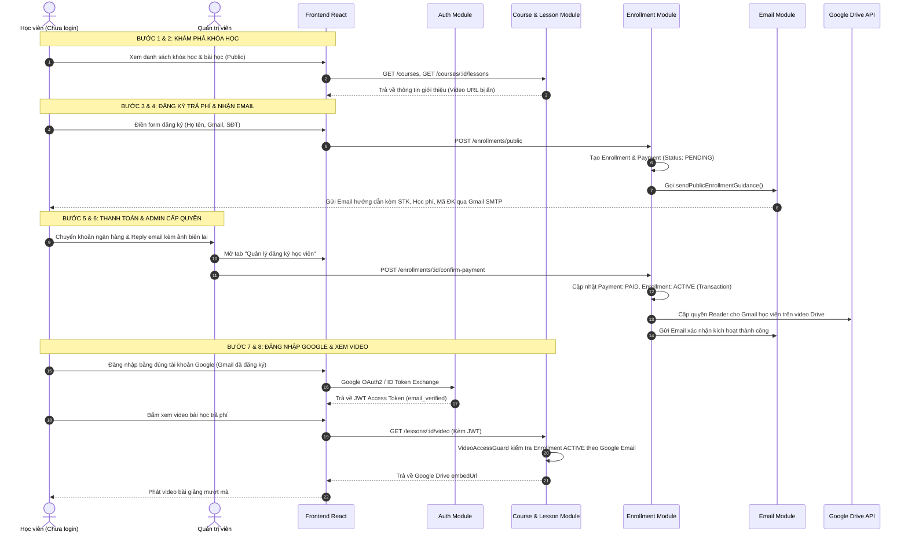
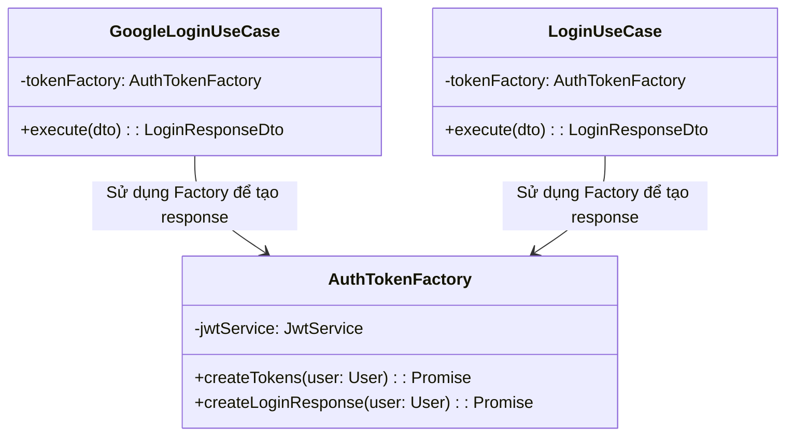
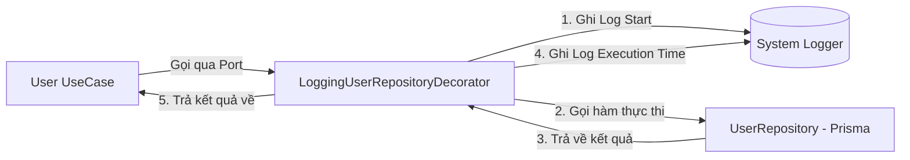
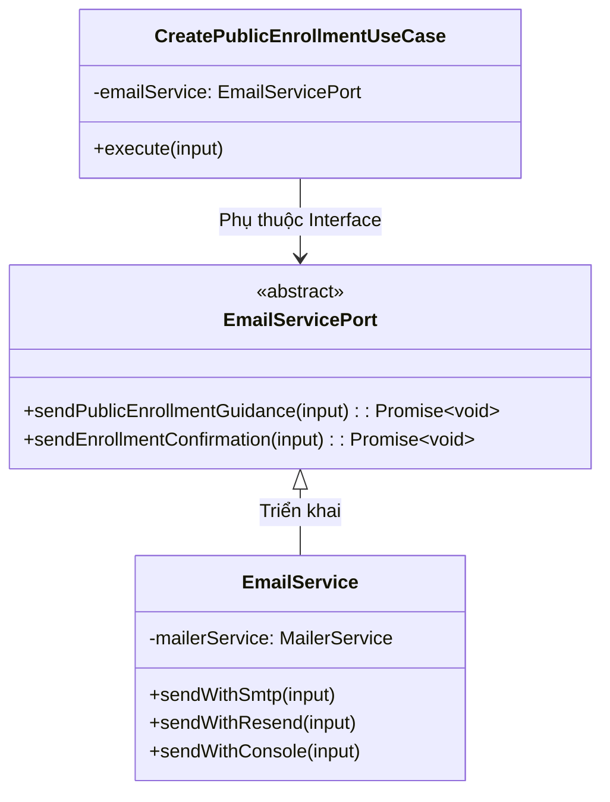
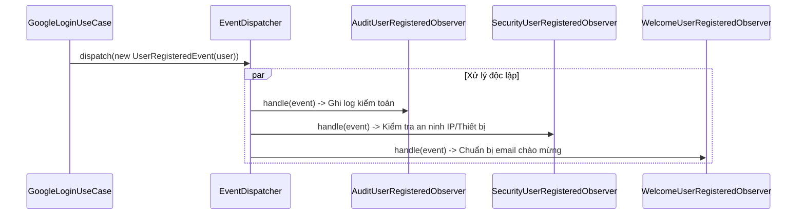
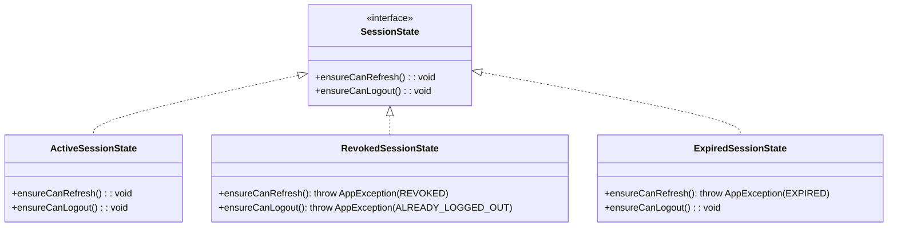

# 🎓 BÁO CÁO THUYẾT TRÌNH: DESIGN PATTERNS & QUY TRÌNH HỆ THỐNG E-LEARNING

---

## 🚀 PHẦN 1: QUY TRÌNH TỔNG THỂ CỦA HỆ THỐNG (END-TO-END WORKFLOW)

Quy trình nâng cấp từ hệ thống quản lý thành viên thành nền tảng học trực tuyến hoàn chỉnh gồm 8 bước khép kín:

```
[1. Xem danh sách khóa học] 
       ↓
[2. Xem thông tin bài học] 
       ↓
[3. Đăng ký nội dung trả phí (Form Intake)] 
       ↓
[4. Tự động nhận Email hướng dẫn (Gmail SMTP + EJS)] 
       ↓
[5. Chuyển khoản học phí & Phản hồi xác nhận] 
       ↓
[6. Admin xác nhận & Cấp quyền Gmail Drive] 
       ↓
[7. Đăng nhập hệ thống bằng Google OAuth2] 
       ↓
[8. Mở khóa & Xem video bài giảng]
```

### Sơ đồ tuần tự tương tác giữa các Module (Sequence Diagram)



---

## 🧩 PHẦN 2: BẢNG TỔNG HỢP CÁC DESIGN PATTERNS ÁP DỤNG

| # | Tên Design Pattern | Nhóm (GoF Category) | Module / Chức năng áp dụng | Vấn đề giải quyết |
|---|---|---|---|---|
| **1** | **Factory Pattern** | **Creational** *(Khởi tạo)* | `AuthModule` (`AuthTokenFactory`), `SessionModule` (`SessionStateFactory`) | Tập trung hóa logic tạo chuỗi JWT tokens và khởi tạo các đối tượng trạng thái phiên |
| **2** | **Decorator Pattern** | **Structural** *(Cấu trúc)* | `UserModule` (`LoggingUserRepositoryDecorator`) | Bổ sung tính năng ghi log, đo thời gian cho Repository mà không can thiệp code gốc (Open/Closed Principle) |
| **3** | **Strategy Pattern** | **Behavioral** *(Hành vi)* | `Common/Secret` (`PasswordHasherStrategy`), `EmailModule` (`EmailServicePort`), `EnrollmentModule` (`PaymentGatewayPort`) | Tách rời thuật toán băm mật khẩu, cổng thanh toán và dịch vụ gửi mail khỏi Use Case, cho phép tráo đổi linh hoạt |
| **4** | **Observer Pattern** | **Behavioral** *(Hành vi)* | `AuthModule` (`EventDispatcher`, `UserRegisteredEvent`, Observers) | Tách rời luồng đăng ký tài khoản khỏi các tác vụ phụ (Audit log, Security alert, Welcome mail) |
| **5** | **State Pattern** | **Behavioral** *(Hành vi)* | `SessionModule` (`SessionState`, `Active`, `Revoked`, `Expired`) | Loại bỏ các câu lệnh `if/else` hoặc `switch/case` phức tạp khi kiểm tra tính hợp lệ của phiên đăng nhập |

---

## 🔍 PHẦN 3: CHI TIẾT TỪNG DESIGN PATTERN THEO RUBRIC

---

### 1. FACTORY PATTERN

- **Tên Design Pattern:** Factory Pattern
- **Nhóm:** `Creational Pattern` (Nhóm khởi tạo đối tượng)
- **Vị trí áp dụng trong mã nguồn:**
  - `src/modules/auth/factories/auth-token.factory.ts`
  - `src/modules/sessions/states/session-state.factory.ts`

#### Vấn đề giải quyết:
Khi người dùng đăng nhập thành công (bằng mật khẩu hoặc Google OAuth2), hệ thống cần:
1. Tạo Payload chuẩn cho Access Token.
2. Tạo Payload chuẩn cho Refresh Token.
3. Ký số bằng `JwtService`.
4. Map dữ liệu User thực thể sang DTO phản hồi.
Nếu đặt toàn bộ logic này trong từng Use Case (`LoginUseCase`, `GoogleLoginUseCase`, `RefreshTokenUseCase`), code sẽ bị trùng lặp, cồng kềnh và khó bảo trì khi cần thay đổi thời gian hết hạn hoặc cấu trúc payload.

#### Lợi ích sau khi áp dụng:
- **Tập trung hóa:** Mọi quy tắc đóng gói JWT Token và Session Object nằm tại một nơi duy nhất.
- **Dễ bảo trì & Mở rộng:** Khi cần thêm claims vào token (ví dụ: `roles`, `permissions`), chỉ cần sửa tại Factory mà không chạm vào các Use Cases.

#### Minh họa bằng Code & Luồng hoạt động:



```typescript
// src/modules/auth/factories/auth-token.factory.ts
@Injectable()
export class AuthTokenFactory {
  constructor(private readonly jwtService: JwtService) {}

  async createLoginResponse(user: User) {
    const payload = { sub: user.id, email: user.email, role: user.role };
    const [accessToken, refreshToken] = await Promise.all([
      this.jwtService.signAsync(payload, { expiresIn: '1h' }),
      this.jwtService.signAsync(payload, { expiresIn: '7d' }),
    ]);

    return {
      accessToken,
      refreshToken,
      user: UserMapper.toResponse(user),
    };
  }
}
```

---

### 2. DECORATOR PATTERN

- **Tên Design Pattern:** Decorator Pattern
- **Nhóm:** `Structural Pattern` (Nhóm cấu trúc)
- **Vị trí áp dụng trong mã nguồn:**
  - `src/modules/users/repositories/logging-user-repository.decorator.ts`
  - Khai báo DI trong `src/modules/users/user.module.ts`

#### Vấn đề giải quyết:
Hệ thống cần ghi nhật ký (Logging) thời gian xử lý, tên hàm và tham số truy vấn cho tất cả các thao tác với bảng `users` trong cơ sở dữ liệu để phục vụ việc giám sát hiệu năng. Nếu chèn `logger.log()` vào từng hàm trong `UserRepository`, mã nguồn sẽ bị rác, vi phạm nguyên lý Single Responsibility Principle (SRP).

#### Lợi ích sau khi áp dụng:
- **Tuân thủ Open/Closed Principle:** Mở rộng tính năng ghi log cho Repository mà không cần sửa đổi dù chỉ 1 dòng code trong `UserRepository` gốc.
- **Trong suốt với tầng nghiệp vụ:** Tầng Use Case vẫn gọi qua interface `UserRepositoryPort`, hoàn toàn không biết có Decorator bọc bên ngoài.

#### Minh họa bằng Code & Luồng hoạt động:



```typescript
// src/modules/users/repositories/logging-user-repository.decorator.ts
@Injectable()
export class LoggingUserRepositoryDecorator extends UserRepositoryPort {
  private readonly logger = new Logger('UserRepository');

  constructor(private readonly target: UserRepository) {
    super();
  }

  async findByEmail(email: string): Promise<User | null> {
    const start = Date.now();
    this.logger.debug(`[Query] findByEmail: ${email}`);
    const result = await this.target.findByEmail(email);
    this.logger.debug(`[Done] findByEmail took ${Date.now() - start}ms`);
    return result;
  }
  // Các hàm khác được bọc tương tự...
}
```

---

### 3. STRATEGY PATTERN

- **Tên Design Pattern:** Strategy Pattern
- **Nhóm:** `Behavioral Pattern` (Nhóm hành vi)
- **Vị trí áp dụng trong mã nguồn:**
  - **Mã hóa mật khẩu:** `src/common/secret/hashing/password-hasher.strategy.ts` (Abstract Strategy) & `bcrypt-password-hasher.strategy.ts` (Concrete Strategy).
  - **Gửi Email:** `src/modules/email/email.service.ts` (`EmailServicePort` với các chiến lược `smtp` Gmail EJS, `resend` REST API, `console` Logger).
  - **Thanh toán:** `src/modules/enrollments/payment/payment-gateway.ts` (`PaymentGatewayPort` và `MockPaymentGateway`).

#### Vấn đề giải quyết:
Hệ thống cần thay đổi các thuật toán/dịch vụ bên thứ ba tùy theo môi trường:
- Chạy local dev/test: Sử dụng `console` logger hoặc `MockPaymentGateway`.
- Chạy production: Sử dụng Gmail SMTP qua `nodemailer` + `ejs` template hoặc kết nối cổng thanh toán thật (VNPay/Stripe).
Nếu hardcode logic trực tiếp, mỗi lần đổi dịch vụ sẽ phải sửa lại toàn bộ Use Cases.

#### Lợi ích sau khi áp dụng:
- **Dependency Inversion Principle (DIP):** Các Use Cases cấp cao (`CreatePublicEnrollmentUseCase`, `LoginUseCase`) chỉ phụ thuộc vào Interface/Port trừu tượng, không phụ thuộc vào thư viện cụ thể.
- **Hoán đổi chiến lược trong nháy mắt:** Chỉ cần đổi biến môi trường `EMAIL_PROVIDER=smtp` hoặc `console` mà không cần build lại mã nguồn.

#### Minh họa bằng Code & Luồng hoạt động:



```typescript
// Use case chỉ gọi qua Port, hoàn toàn độc lập với việc gửi bằng Gmail hay Resend
@Injectable()
export class CreatePublicEnrollmentUseCase {
  constructor(
    private readonly enrollmentRepository: EnrollmentRepositoryPort,
    private readonly emailService: EmailServicePort, // Abstraction Port
  ) {}

  async execute(input: CreatePublicEnrollmentDto) {
    const enrollment = await this.enrollmentRepository.createPublicPending({...});
    // Chiến lược gửi email được quyết định động
    await this.emailService.sendPublicEnrollmentGuidance({
      recipient: input.contactEmail,
      courseTitle: course.title,
      amount: enrollment.payment.amount,
      ...
    });
  }
}
```

---

### 4. OBSERVER PATTERN (EVENT-DRIVEN ARCHITECTURE)

- **Tên Design Pattern:** Observer Pattern (Pub/Sub)
- **Nhóm:** `Behavioral Pattern` (Nhóm hành vi)
- **Vị trí áp dụng trong mã nguồn:**
  - Bộ phát sự kiện: `src/common/events/event-dispatcher.ts`
  - Định nghĩa sự kiện: `src/modules/auth/events/user-registered.event.ts`
  - Các Observers lắng nghe:
    - `src/modules/auth/observers/audit-user-registered.observer.ts` (Ghi log kiểm toán)
    - `src/modules/auth/observers/security-user-registered.observer.ts` (Cảnh báo bảo mật tài khoản mới)
    - `src/modules/auth/observers/welcome-user-registered.observer.ts` (Gửi mail chào mừng)
  - Đăng ký Observer: `src/modules/auth/auth-event-registrar.ts`

#### Vấn đề giải quyết:
Khi một người dùng mới đăng ký tài khoản (qua Google OAuth2 hoặc đăng ký thường), hệ thống cần thực hiện nhiều tác vụ thứ cấp: ghi audit log vào DB, bắn cảnh báo bảo mật, gửi thư chào mừng. Nếu viết tất cả vào `GoogleLoginUseCase`, use case sẽ bị phình to và vi phạm nguyên lý Single Responsibility.

#### Lợi ích sau khi áp dụng:
- **Loose Coupling (Giảm sự phụ thuộc):** Tầng đăng nhập chỉ cần phát tín hiệu *"User vừa đăng ký"* rồi hoàn tất.
- **Dễ dàng mở rộng:** Khi muốn bổ sung tính năng mới (ví dụ: tặng 50 xu thưởng cho tài khoản mới), chỉ cần tạo thêm `RewardUserRegisteredObserver` và đăng ký vào Dispatcher mà không cần sửa `GoogleLoginUseCase`.

#### Minh họa bằng Code & Luồng hoạt động:



```typescript
// Đăng ký các Observer vào Dispatcher tại startup
@Injectable()
export class AuthEventRegistrar implements OnModuleInit {
  constructor(
    private readonly dispatcher: EventDispatcher,
    private readonly auditObserver: AuditUserRegisteredObserver,
    private readonly securityObserver: SecurityUserRegisteredObserver,
    private readonly welcomeObserver: WelcomeUserRegisteredObserver,
  ) {}

  onModuleInit() {
    this.dispatcher.register(UserRegisteredEvent.EVENT_NAME, this.auditObserver);
    this.dispatcher.register(UserRegisteredEvent.EVENT_NAME, this.securityObserver);
    this.dispatcher.register(UserRegisteredEvent.EVENT_NAME, this.welcomeObserver);
  }
}
```

---

### 5. STATE PATTERN

- **Tên Design Pattern:** State Pattern
- **Nhóm:** `Behavioral Pattern` (Nhóm hành vi)
- **Vị trí áp dụng trong mã nguồn:**
  - Interface trạng thái: `src/modules/sessions/states/session-state.interface.ts`
  - Các trạng thái cụ thể:
    - `src/modules/sessions/states/active-session.state.ts` (Phiên đang hoạt động)
    - `src/modules/sessions/states/revoked-session.state.ts` (Phiên đã bị thu hồi/đăng xuất)
    - `src/modules/sessions/states/expired-session.state.ts` (Phiên đã hết hạn)
  - Factory chọn trạng thái: `src/modules/sessions/states/session-state.factory.ts`

#### Vấn đề giải quyết:
Phiên đăng nhập (`Session`) của người dùng có nhiều trạng thái khác nhau (`ACTIVE`, `REVOKED`, `EXPIRED`). Hành vi cho phép *"Làm mới token (Refresh)"* hay *"Đăng xuất (Logout)"* phụ thuộc vào trạng thái hiện tại. Nếu kiểm tra bằng các chuỗi `if (status === 'ACTIVE') ... else if (status === 'REVOKED') ...` ở khắp nơi sẽ dẫn đến lỗi sót điều kiện và khó bảo trì.

#### Lợi ích sau khi áp dụng:
- **Đóng gói hành vi theo trạng thái:** Mỗi trạng thái tự định nghĩa quyền của mình (`ActiveSessionState` cho phép refresh, `RevokedSessionState` tự động ném ra lỗi `AppException(SessionError.REVOKED)`).
- **Mở rộng dễ dàng:** Nếu hệ thống bổ sung trạng thái mới như `SUSPENDED` (tạm khóa), chỉ cần tạo `SuspendedSessionState` mà không làm vỡ logic cũ.

#### Minh họa bằng Code & Luồng hoạt động:



```typescript
// Trong RefreshTokenUseCase:
const session = await this.sessionRepository.findById(sessionId);
const state = this.sessionStateFactory.create(session.status);

// Không cần if/else, state tự quyết định có cho phép refresh hay không
state.ensureCanRefresh(); 
```

---

## 🎯 TỔNG KẾT BÀI THUYẾT TRÌNH

1. **Kiến trúc Clean Architecture:** Dự án chia tách rõ ràng giữa Controller $\rightarrow$ Use Case $\rightarrow$ Repository Port $\rightarrow$ Database Adapter.
2. **Áp dụng 5 Design Patterns chuẩn GoF:** Bao quát cả 3 nhóm **Creational**, **Structural**, và **Behavioral**, giải quyết trực diện các bài toán về khởi tạo token, kiểm toán logging, tráo đổi dịch vụ gửi mail/thanh toán, xử lý sự kiện bất đồng bộ và quản lý trạng thái phiên đăng nhập.
3. **Quy trình học trực tuyến bảo mật & chi phí thấp:**
   - Người dùng được xem danh sách bài học công khai.
   - Khi đăng ký, hệ thống tự động gửi email hướng dẫn qua **Gmail SMTP (EJS Template)**.
   - Video lưu trữ trên Google Drive giúp tiết kiệm 100% băng thông streaming, được bảo vệ 2 lớp bởi **`VideoAccessGuard`** và phân quyền trực tiếp theo địa chỉ Gmail của học viên.
